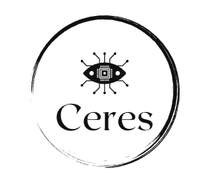
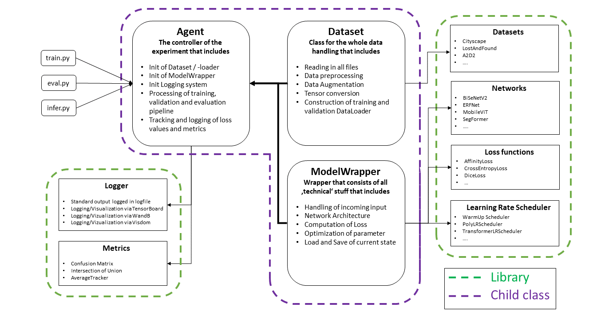
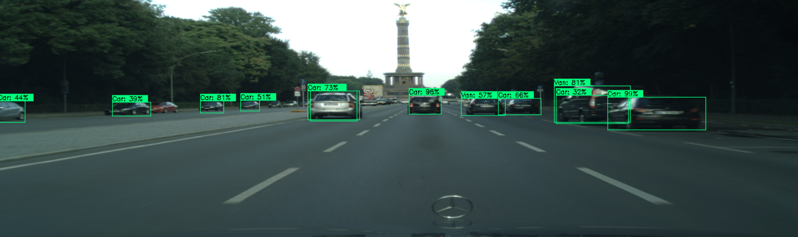

# Ceres :nerd_face:
> A simple PyTorch project that focus on computer vision tasks. Mainly used for creating a training and evaluation pipeline.

<!-- PROJECT LOGO -->
<p align="left">
  <a href="https://htmlpreview.github.io/?https://github.com/tbuechler/Ceres/blob/main/docs/index.html">Explore the docs</a>
  ·
  <a href="#Demo">View Demo</a>
  ·
  <a href="https://git.hub.vwgroup.com/fixccsf/Ceres/issues">Report Bug</a>
  ·
  <a href="https://git.hub.vwgroup.com/fixccsf/Ceres/issues">Request Feature</a>
</p>


Explore the deployment repository: <a href="https://git.hub.vwgroup.com/fixccsf/Spes">Spes</a>. :fire:  
Auto-generate documentation for python code: <a href="https://github.com/tbuechler/PyDoc">PyDoc</a>. :eyes:


<br>


## NOTE 
This project is work in progress since it will be moved from a private repository to make it public. The documentation can be old/wrong at some points and the implementation not clean as it has to be. More parts/refinements will be added with time, i.e.:

1. Azure ML connection
2. Docker containerization
3. Custom (cuda) kernel operations
4. More models and corresponding custom classes that need to be cleared first...

<!-- ABOUT THE PROJECT -->
## About The Project
  <p align="center">
    <a href="https://git.hub.vwgroup.com/fixccsf/Ceres/tree/main/source/agents">Agent</a>
    ·
    <a href="https://git.hub.vwgroup.com/fixccsf/Ceres/tree/main/source/datasets">Dataset</a>
    ·
    <a href="https://git.hub.vwgroup.com/fixccsf/Ceres/tree/main/source/models">Modelwrapper</a>
    ·
    <a href="https://git.hub.vwgroup.com/fixccsf/Ceres/tree/main/source/networks">Networks</a>
    ·
    <a href="https://git.hub.vwgroup.com/fixccsf/Ceres/tree/main/source/loggers">Logger</a>
    ·
    <a href="https://git.hub.vwgroup.com/fixccsf/Ceres/tree/main/source/losses">Loss</a>
    ·
    <a href="https://git.hub.vwgroup.com/fixccsf/Ceres/tree/main/source/lr_scheduler">Optimizer</a>
    ·
    <a href="https://git.hub.vwgroup.com/fixccsf/Ceres/tree/main/source/metrics">Metrics</a>
  </p>

<p align="center">
<kbd>
  
</kbd>
</p>

Lorem ipsum dolor sit amet, consectetuer adipiscing elit. Aenean commodo ligula eget dolor. Aenean massa. Cum sociis natoque penatibus et magnis dis parturient montes, nascetur ridiculus mus. Donec quam felis, ultricies nec, pellentesque eu, pretium quis, sem. Nulla consequat massa quis enim.

Here's why :heart::
* Donec quam felis, ultricies nec, pellentesque eu, pretium quis, sem. Nulla consequat massa quis enim.
* Donec quam felis, ultricies nec, pellentesque eu, pretium quis, sem. Nulla consequat massa quis enim.
* Donec quam felis, ultricies nec, pellentesque eu, pretium quis, sem. Nulla consequat massa quis enim. :smile:

Lorem ipsum dolor sit amet, consectetuer adipiscing elit. Aenean commodo ligula eget dolor. Aenean massa. Cum sociis natoque penatibus et magnis dis parturient montes, nascetur ridiculus mus. Donec quam felis, ultricies nec, pellentesque eu, pretium quis, sem. Nulla consequat massa quis enim. Donec pede justo, fringilla vel, aliquet nec, vulputate eget, arcu. In enim justo, rhoncus ut, imperdiet a, venenatis vitae, justo. 

Use the `BLANK_README.md` to get started.


<!-- GETTING STARTED -->
## Getting Started
### Prerequisites

* hydra-core==1.3.2
* imgaug==0.4.0
* numpy==1.23.4
* omegaconf==2.2.3
* opencv_python==4.6.0.66
* Pillow==10.1.0
* PyYAML==6.0.1
* torch==2.0.1
* torchvision==0.15.2
* tqdm==4.64.1
* webcolors==1.12

### Customization
You can customize your project by select


### Configuration
To customize your current project, for instance by selecting a different network architecture, different hyperparameter set or something else, you can use the mandatory configuration .yaml-file. The .yaml-file is imported directly using the hydra package from facebook. To make the framework to use your custom config file, just simply change the config name in the eval and train script.


``` yaml
# YAML
experiment:
  name: "SemanticSegmentation_Cityscape_ERFNet"
  use_cuda: True

agent:
  name: "SemSegAgent"
  use_tensorboard: True
  use_wandb: False
  num_classes: 19
  max_epoch: 500

model_wrapper:
  name: "ERFNet"
  network:
    name: "ERFNet"
    input_channels: 3

dataset:
  name: "CityscapeDS"
  root: "../cityscape"
  ignore_mask_value: 255
  crop_images: True
  data_augmentation: True

dataloader:
  validation_ratio: 0.05
  batch_size: 4
  num_workers: 1
```

While some parameters are required to be defined (see <a href="https://git.hub.vwgroup.com/fixccsf/Ceres/tree/main/configs">Config</a>), you can freely add as many parameters as you wish and need in your project.

In general, you can access each parameter directly from all of your derived classes.

```python
# Print processed dataset.
print(self.cfg.dataset.name)
```

### Run your project
For training, just make sure that the correct config file is used in

```python
@hydra.main(config_path="../configs", config_name="example_train")
```

and run 
```python
$ python scripts/train.py
```

For evaluation do the same thing and run
```python
$ python scripts/eval.py
```


## :star: Demo <a name="Demo"> </a>
Just a few examples of different projects having used this project. Demos are not meant to be to show the best results, since everything was trained only on a short period of time.

<details>
<summary>2D Object Detection</summary>
<br>
<p align="center">
<kbd>
  
</kbd>
</p>
</details>
<br>
<details>
<summary>2D Semantic Segmentation</summary>
<br>
<p align="center">
<kbd>
  
</kbd>
</p>
</details>


<!-- CONTRIBUTING -->
## :writing_hand:	Contributing

Contributions are what make the open source community such an amazing place to learn, inspire, and create. Any contributions you make are **greatly appreciated**.

If you have a suggestion that would make this better, please fork the repo and create a pull request. You can also simply open an issue with the tag "enhancement".
Don't forget to give the project a star! Thanks again!

1. Fork the Project
2. Create your Feature Branch (`git checkout -b feature/AmazingFeature`)
3. Commit your Changes (`git commit -m 'Add some AmazingFeature'`)
4. Push to the Branch (`git push origin feature/AmazingFeature`)
5. Open a Pull Request


<!-- CONTACT -->
## :email: Contact	

If you have questions or remarks, feel free to create an issues or contact me via [email](mailto:t.buechler@outlook.com).