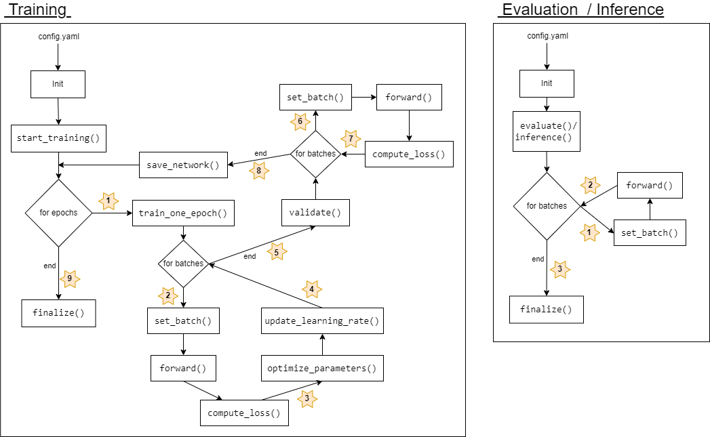

## Standard Agent: BaseAgent.py
The purpose of the BaseAgent is to provide the whole process of training, evaluation and/or inference of a model on a certain dataset. The overall pipeline is fixed and must not be changed or override by the user. This includes:
* Initialization of dataset/-loader according to config file entry
* Initialization of modelwrapper according to config file entry
* Initialization of logging instances according to config file entry
* Looping over all epochs and batches
* Fetching current batch from dataloader and pass it to the ModelWrapper
* Calling model inference and parameter update methods in feasible order (s. image below)

The BaseAgent is <b>NOT</b> responsible for tracking the progress of the training, evaluation or inference procedure. There is no computation of any metrics or any deeper logging done in the BaseAgent. This needs to be done in your Custom Agent using the available abstract methods.

<kbd>
  
</kbd>

 

## Custom Agent

Derive your own class from BaseAgent to track the whole process by override all methods marked with :star:. In your own class you can compute and track metrics of the current process, since you got direct access to the used modelwrapper, current batch, prediction and loss value for instance.

The BaseAgent provides multiple methods to override which are placed at useful spots in the whole process to track specific information for the enduser. By default these methods are doing nothing and can be filled with live by the user.

|       | Training  | Evaluation    | Inference    |
| :---  | :---:        |      :---:          |    :---:  |
| 1.    | self.start_train_valid_epoch() | self.start_eval_batch()   | self.start_infer_batch()   |
| 2.    | self.start_train_batch()      | self.end_eval_batch()     | self.end_infer_batch()     |
| 3.    | self.end_train_loss()         | self.end_of_evaluation()  | self.end_of_inference()  |
| 4.    | self.end_train_optim_param()   |                     | |
| 5.    | self.end_train_epoch()        |                     | |
| 6.    | self.start_valid_batch()      |                     | |
| 7.    | self.end_valid_batch()        |                     | |
| 8.    | self.end_valid_epoch()        |                     | |
| 9.    | self.finalize_epochs()        |                     | |

